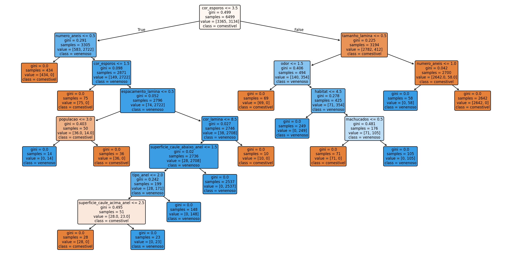

# 🍄 Classificador de Cogumelos - Árvore de Decisão

Esse é mais um projeto com o intuito de auto aprendizagem a cerca de algoritmos de aprendizado de máquina! Dessa vez, aprendi sobre **Árvore de Decisão**. 
Esse algoritmo que funciona exatamente como o nome sugere: a máquina faz uma série de perguntas em sequência, como um fluxograma, até chegar a uma resposta.
Cada "nó" da árvore é uma pergunta sobre uma feature, e cada "folha" é uma decisão final.
É um dos algoritmos mais fáceis de entender porque você consegue ler as regras que ele aprendeu em português mesmo.

---

## 📚 O que aprendi

- **LabelEncoder** — transforma texto (chamado de `object` em dataframes pandas) em números, já que a máquina só entende números. Ex: `convexo → 0`, `sino → 1`
- **train_test_split** — divide o dataset em treino (80%) e teste (20%), pra avaliar se o modelo realmente aprendeu ou só decorou os dados
- **DecisionTreeClassifier** — o modelo em si; aprende as regras durante o treino com `.fit()` e faz previsões com `.predict()`
- **feature_importances_** — mostra quais características o modelo considerou mais decisivas
- **accuracy_score e classification_report** — métricas pra avaliar o desempenho do modelo
---

## 📊 Resultado

**Acurácia: 100%** (Parece, mas e não é overfitting!)

Como mostram os testes e prints, a árvore conseguiu tomar decisões com base em apenas **8 perguntas**, chegando a **15 folhas** com certeza absoluta (gini = 0.0). Isso se dá pela qualidade do dataset, que é bem objetivo e balanceado (4208 comestíveis / 3916 venenosos).

A feature mais importante foi **cor dos esporos** (52% de importância)! Achei interessantíssimo como a máquina levou em conta o mesmo que a maioria dos biólogos: cor. Na natureza, cor é um sinal de perigo em diversas espécies — não só fungos, mas animais e plantas também. O modelo usou essa feature como base para todas as decisões, o que faz total sentido biológico.

---

## 🌳 Visualização da Árvore



---

## 🔮 Próximos passos

Futuramente pretendo criar um dataset de imagens, tiradas por mim mesma em campo, e atualizar o modelo para que ele aponte se o cogumelo da foto é ou não comestível. Ousado? Talvez. Divertido? Com certeza!

---

## 🗂️ Dataset

O dataset utilizado é uma tradução para o português do famoso **UCI Mushroom Dataset**, originalmente disponível em:
- UCI Machine Learning Repository: https://archive.ics.uci.edu/dataset/73/mushroom
- Versão original no Kaggle: https://www.kaggle.com/datasets/uciml/mushroom-classification

**8124 amostras · 22 features · 2 classes (comestível / venenoso)**

---

## 🛠️ Como rodar

```bash
pip install pandas scikit-learn matplotlib
python cogumelos.py
```
